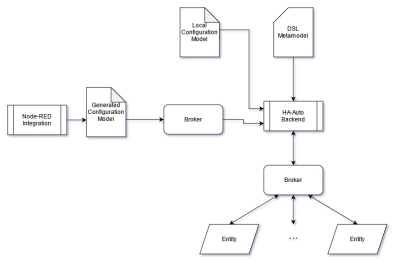

# HA-Auto


[](https://GitHub.com/eellak/gsoc2021-HA-Auto-Node-RED/tags/)
[](https://github.com//eellak/gsoc2021-HA-Auto-Node-RED/blob/main/LICENSE)

## Description
HA-Auto is a Domain Specific Language (DSL) that enables users to program complex 
automation scenarios, for connected IoT devices, that go beyond simple automation rules. 
HA-Auto is built using Python and is based on the model interpretation paradigm.

To make HA-Auto even easier to use, the language has been integrated in Node-RED’s flow-based low-code environment.
For the HA-Auto Node-RED integration see the 
[node-red-contrib-ha-auto](https://github.com/CedArctic/node-red-contrib-ha-auto) repository.

## Overview
The diagram bellow illustrates how HA-Auto works. The HA-Auto Backend, which is hosted in this repository, 
reads the HA-Auto DSL Metamodel and uses it to parse a Configuration Model which contains all the details specific to 
the environment of a user. The Configuration Model can be either written directly in textual form, or generated using 
the HA-Auto Node-RED integration inside the Node-RED low code programming environment. After that, the HA-Auto Backend
interprets the Configuration Model to execute Automations. This is done by exchanging information with devices 
(Entities) in the user environment through message Brokers.



## Installation
Installing HA-Auto is easy. Make sure you have [Python 3](https://www.python.org/) and then follow these steps:
1. Download the latest release zip [here](https://github.com/eellak/gsoc2021-HA-Auto-Node-RED/releases)
2. Unzip the release to your preferred directory and open config.py to set your preferences. 
   Set `RUN_MODE` to `"Local"` if you want to write your configuration model by hand, or to `"MQTT"` to create and deploy
   your configuration model using the [Node-RED integration](https://github.com/CedArctic/node-red-contrib-ha-auto).
   1. If you are running in `MQTT` mode also fill in the information for the broker used for Node-RED - HA-Auto 
      communication.
   2. If you are running in `Local` mode, write your configuration model and place it in `config/config_local.model`.
      For instructions on writing a configuration model see 
      [Writing a Configuration Model](#writing-a-configuration-model).
3. Open the command prompt to the directory and run ```pip install requirements.txt``` to install requirements.
4. In the installation directory run ```python main.py```
   1. If you are running in MQTT mode to use the [Node-RED integration](https://github.com/CedArctic/node-red-contrib-ha-auto)
      to create your configuration model, you should now switch over to Node-RED to create your model. 
      Click Deploy when you are ready and HA-Auto will receive and execute the configuration model automatically.
      

## Writing a Configuration Model
A HA-Auto Configuration Model tells HA-Auto everything you want it to do. It contains information about the various 
devices in your environment (e.g: lights, thermostats, smart fridges etc.), the way they communicate and all the 
automated tasks you want them to perform. The basic components of a Configuration Model are Entities, Brokers and 
Automations.


### Brokers
The Broker acts as a post office for messages where each device has its own Topic which is basically a mailbox for 
sending and receiving messages. 
HA-Auto supports Brokers using the MQTT, AMQP and Redis message broker protocols.
You can configure a Broker in HA-Auto using the syntax in the following example:
```yaml
mqtt:
    name: upstairs_broker
    host: "192.168.1.5"
    port: 1883
    credentials:
        username: "my_username"
        password: "my_password"
```
- **type:** The first line can be `mqtt`, `amqp` or `redis` according to the Broker type
   - **host:** Host IP address or hostname for the Broker
   - **port:** Broker Port number
   - **credentials:**
      - **username:** Username used for authentication
      - **password:** Password used for authentication
   - **vhost:** Vhost parameter. Only for AMQP brokers
   - **exchange:** (_Optional_) Exchange parameter. Only for AMQP brokers.
   - **db:** (_Optional_) Database number parameter. Only for Redis brokers.

### Entities
Entities are your connected smart devices that send and receive information using a message broker. 
Entities have the following properties: a Name, a Broker, a Topic and a set of Attributes.

Attributes are what define the structure and the type of information in the messages the Entity sends via the Broker.

You can configure an Entity in HA-Auto using the syntax in the following example:
```yaml
entity:
    name: robot_cleaner
    topic: "bedroom.robot_cleaner"
    broker: upstairs_broker
    attributes:
        - battery: float,
        - cleaning_mode: string,
        - on: bool,
        - destinations: list,
        - location: {
            - x: int,
            - y: int
        }
```

- **name:** The name for the Entity. Should start with a letter, can contain only letters, numbers and underscores.
- **topic:** The Topic in the Broker used by the Entity to send and receive messages. Note that `/` should be 
  substituted with `.` (e.g: `bedroom/aircondition` -> `bedroom.aircondition`).
- **broker:** The name property of a previously defined Broker which the Entity uses to communicate.
- **attributes:** Attributes have a name and a type. As can be seen in the above example, HA-Auto supports 
  `int`, `float`, `string`, `bool`, `list` and dictionary types. Note that nested dictionaries are also supported.

### Automations
Automations allow the execution of a set of actions when a condition is met. 
Actions are performed by sending messages to Entities. 

You can configure an Automation in HA-Auto using the syntax in the following example:
```yaml
automation:
    name: start_aircondition
    condition: ((thermometer.temperature > 32) AND (humidity.humidity > 30)) AND (aircondition.on NOT true)
    enabled: true
    continuous: false
    actions:
        - aircondition.temperature:  25.0
        - aircondition.mode:  "cool"
        - aircondition.on:  true
```
- **name:** The name for the Automation. Should start with a letter, can contain only letters, numbers and underscores.
- **condition:** The condition used to determine if actions should be run. 
  See the [Automation wiki page](https://github.com/eellak/gsoc2021-HA-Auto-Node-RED/wiki/Automations) for more 
  information on writing conditions.
- **enabled:** Whether the Automation should be run or not.
- **continuous:** Whether the Automation should automatically remain enabled once its actions have been executed.
- **actions:** The actions that should be run once the condition is met. 
  See the [Automation wiki page](https://github.com/eellak/gsoc2021-HA-Auto-Node-RED/wiki/Automations) for more 
  information on writing actions.


## Examples 
You can find some pre-made examples in the [examples directory](examples).

## Documentation
Documentation can be found in the [wiki](https://github.com/eellak/gsoc2021-HA-Auto-Node-RED/wiki).
Also, the code in this project contains thorough documentation to ensure readability and understandability.

## Project Structure

- [config](config): Contains the HA-Auto configuration files and models.
- [config/config.py](config/config.py): Used to configure the HA-Auto Run Mode, `Local` or `MQTT`, and in the case of 
  `MQTT` the parameters of the broker used to communicate with the Node-RED integration.
- [lang](lang): Contains the textX files used to define the HA-Auto language metamodel. 
  `full_metamodel.tx` is the top level file.
- [lib](lib): Contains the python files used to define classes and functions necessary to interpret the DSL.
- [lib/visualize.py](lib/visualize.py): Standalone tool used to visualize HA-Auto Automations. 
  See [Automation Visualization](#automation-visualization) for more information.
- [node-red-contrib-ha-auto](node-red-contrib-ha-auto): The HA-Auto Node-RED integration package. 
  Present in the repository as a git submodule.
- [main.py](main.py): The project entry point. `main.py` loads configuration files and the metamodel, parses the model
   and executes it by evaluating conditions and running actions.

## Automation Visualization
You can visualize HA-Auto Automations as PlantUML MindMaps using the visualization tool. 

Once you have created your model either by following [Writing a Configuration Model](#writing-a-configuration-model) or 
by using the [Node-RED Integration](https://github.com/eellak/gsoc2021-HA-Auto-Node-RED/), you can visualize automations
by opening a terminal in the HA-Auto installation directory and running:
```
python -m lib.visualize visualize lang\full_metamodel.tx my_config.model my_automation --out my_visualization.pu
```
Substitute `my_config.model` with your configuration model, `my_automation` with the name of the Automation you want to 
visualize and `my_visualization` with your preferred output filename.

_Note_: Node-RED created models are located in `config/config_mqtt.model`.

## GSoC 🌞
This project was created as part of Google Summer of Code 2021 with GFOSS as the mentor organization.
More information can be found on the 
[GSoC project page](https://summerofcode.withgoogle.com/projects/#5246257838161920).

## Future Plans
This section analyzes some plans for further developing the project.

### Accessors Support
The HA-Auto DSL currently has support for lists and dictionaries and supports nesting them in each other.
However, conditions currently do not support accessors for these two structures. 
The addition of accessor support will allow the user to write conditions like `robot_cleaner.coordinates["x"] == 5` or 
`robot_cleaner.destinations[3] != "kitchen"`.

### Conditional Automation Re-Enable
An Automation that has the continuous setting set to false, becomes disabled once its condition and its actions have 
been run. An additional condition can be added to the Automation under which the Automation becomes enabled again.

### Math Operator Support
Add math operator support to allow writing conditions like 
`porch_thermometer.temperature > kitchen_thermometer.temperature + 5`

### Error Checking Support for Node-RED integration
Using deeper parsing techniques, the Node-RED integration can provide on the fly error checking and feedback when the
user is generating the Configuration Model.
