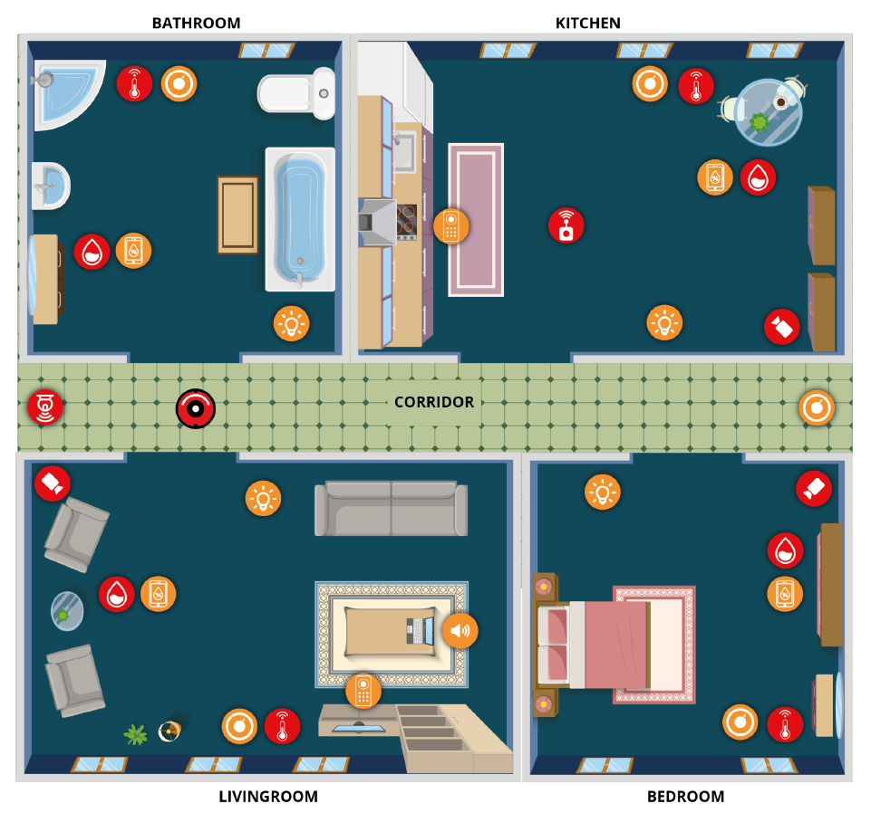

# Smart Home

## Introduction
This example takes place in a simulated Smart Home environment with five spaces and a variety of sensors and actuators
in each of them. All sensors and actuators send and receive information through their appropriate broker channels in a
structured form. 

Image by AUTh SoftEng team. 

## Project Files
- smart_home.png: Top-Down depiction of home with sensors and actuators
- smart_home.model: File containing the Configuration Model with Entities, Brokers and Automations for the Smart
Home Environment